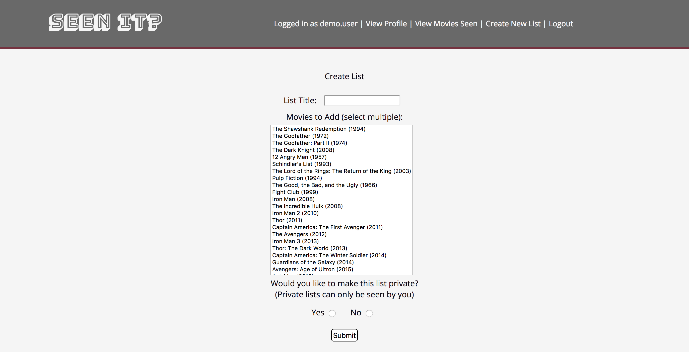

# Seen-O-Phile

## Live App

A live version of the app can be viewed [here](https://seen-it-app.herokuapp.com/). Feel free to use the demo account (credentials in placeholders), or create your own account!

## Summary

"Seen It" is an interactive application allowing users to keep track of the movies they watch. Users can create their own lists or use pre made lists, add those lists to their accounts, then check off movies as they watch them. The app also keeps track of all the movies a user has seen so the user can view their collection!

## Screenshots

Users can login or sign up from this screen.

New users can create an account from this screen.

Users can view lists they've added to their account as well as all the available lists.

This screen displays all the movies in a list, separating them by movies the user has seen and those they haven't. User can click "Seen It" to mark the movies they've seen.

Here users can view a list of every movie they've seen.

This screen allows users to create a new list. Users can choose to make the list public or private. Public lists can be seen and added by other users.

## API

The API for "Seen It" allows the following operations on both the `/lists` and `/movies` endpoints, given a valid JWT is provided:
  * `GET /lists` & `GET /movies` - returns all lists/movies
  * `GET /lists/:id` & `GET /movies/:id` - returns a specific list or movie
  * `POST /lists` & `POST /movies` - adds a new list or movie
  * `PUT /lists/:id` & `PUT /movies/:id` - updates a list or movie
  * `DELETE /lists/:id` - deletes a list

## Future Iterations

In the future, I'd like to provide users with the ability to add movies themselves. This could be achieved using a third party API to grab the movie's title, release year, and poster. This would allow for a greater variety of lists and usability.

## Technology

* Frontend
  * HTML5
  * CSS3
  * jQuery/JavaScript

* Backend
  * Node.js
  * Express
  * MongoDB
  * Mongoose
  * Passport
  * JWT

* Deployment / Testing
  * Mocha
  * Chai
  * Faker.js
  * Travis-CI
  * Heroku
